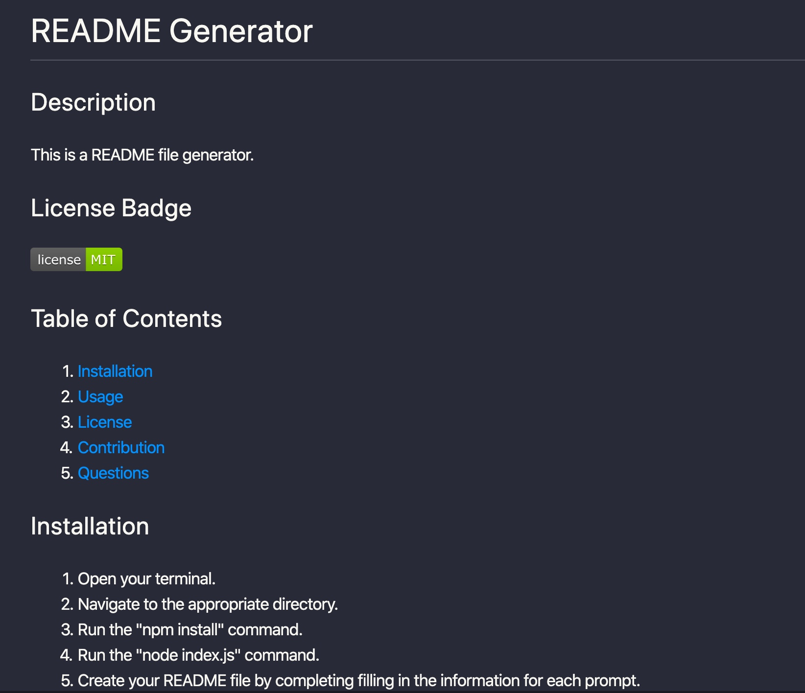

# Good README Generator

## Description
A CLI app that dynamically generates a README file based on a user's input, utilizing Node.js and the Inquirer package.

## User Story
AS A developer  
I WANT a README generator  
SO THAT can quickly create a professional README for a new project  

## Acceptance Criteria
GIVEN a command-line application that accepts user input  
WHEN I am prompted for information about my application repository  
THEN a quality, professional README.md is generated with the title of your project and sections entitled Description, Table of Contents, Installation, Usage, License, Contributing, Tests, and Questions  
WHEN I enter my project title  
THEN this is displayed as the title of the README  
WHEN I enter a description, installation instructions, usage information, contribution guidelines, and test instructions  
THEN this information is added to the sections of the README entitled Description, Installation, Usage, Contributing, and Tests  
WHEN I choose a license for my application from a list of options  
THEN a badge for that license is added hear the top of the README and a notice is added to the section of the README entitled License that explains which license the application is covered under  
WHEN I enter my GitHub username  
THEN this is added to the section of the README entitled Questions, with a link to my GitHub profile  
WHEN I enter my email address  
THEN this is added to the section of the README entitled Questions, with instructions on how to reach me with additional questions  
WHEN I click on the links in the Table of Contents  
THEN I am taken to the corresponding section of the README  

## Technology Used
* Node.js
* Inquirer.js (NPM)

## Links to User Flow Demo and GitHub Repo
* Video of typical user flow: https://bit.ly/34T2fOb
* Link to GitHub Repo: https://github.com/MeganCarnaghi/Good-README-Generator.git

## Screenshot
Example of a README.md generated using this application:

## Instructions for Use
* Open the Terminal and navigate to the directory where the package.json and index.js files live.
* Run the "npm install" command.
* Run the "node index.js" command.
* When presented with each prompt, enter in the appropriate information.
* Once all information has been entered a README file will be created for you.

## License

